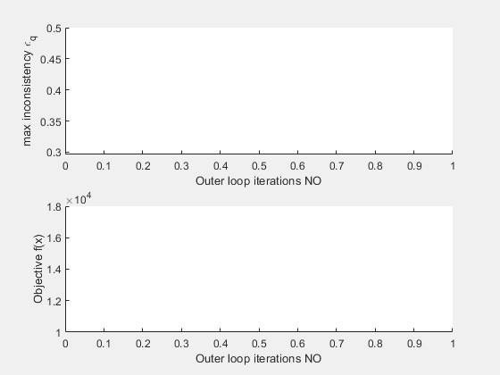

# NoHiMDO (lite)

This is a fork of [NoHiMDO](https://github.com/bastientalgorn/NoHiMDO) intended for pedagogy and interactively displaying optimization progress.

# Example usage

To launch an analytical target cascading problem, you must define:
- A definition file (ex. [SBJ_problem_definition_1.m](SBJ_problem_definition_1.m) and [SBJ_problem_definition_1.m](SBJ_problem_definition_1.m)
	- Describes the nature of the variables in each subproblem
- A subproblem analysis file (ex. [SBJ_subsystem_analysis_1.m](SBJ_subsystem_analysis_1.m) and [SBJ_subsystem_analysis_2.m](SBJ_subsystem_analysis_2.m)
	- Describes how the objectives, constraints, and coupling variables are calculated from the discipline variables

Launch the file [SBJ_main.m](SBJ_main.m). You will see the following progress being displayed in real-time.

	

## Dependencies 

- [**Matlab parallel computing toolbox**](https://www.mathworks.com/products/parallel-computing.html) (optional) for parallel processing of the different subproblems

# Further reading

Please check the following article for more information related to solving non-hierarchical analytical target cascading problems.

- *Numerical investigation of non-hierarchical coordination for distributed multidisciplinary design optimization with fixed computational budget* [1](https://dl.acm.org/doi/abs/10.1007/s00158-016-1489-z)

