# Distributed MDO of Supersonic Business Jet (SBJ)

A supersonic business jet (SBJ) design problem ([described here](https://github.com/MECH559/MECH_559_material/blob/master/Books/Articles/SBJ_BLISS.pdf)) is used to demonstrate different distributed MDO formulations used for solving design problems involving multiple disciplines. The SBJ design problem involves four disciplines; An overall *aircraft*, *propulsion*, *aerodynamics*, and *structural* design subproblems. Each disciplinary analysis is part of its respective optimization subproblem. The disciplinary analyses are implemented in MATLAB are given by the following `.m` files as outlined in the table below.

|Discipline           	| Subproblem  | Inputs                                                                                                                                                          | Output                                                          	| MATLAB file                                                   |
|-----------------------|-------------|-----------------------------------------------------------------------------------------------------------------------------------------------------------------|-------------------------------------------------------------------|---------------------------------------------------------------|
|Aircraft            	| 1           | $W_e$, $W_f$, $W_s$, $h$, $M$, $L/D$, $\text{SFC}$                                                                                                              | $W_t$, $\text{range}$     		                         		| [SBJ_analysis_range.m](SBJ/SBJ_analysis_range.m)              |
|Propulsion 	     	| 2           | $h$, $M$, $T$, $D$                                                                                                                                              | $\text{SFC}$, $W_e$, $\text{ESF}$, $T_{E}$, $\text{Throttle}$   	| [SBJ_analysis_power.m](SBJ/SBJ_analysis_power.m)              |
|Aerodynamics 	     	| 3           | $t/c$, $h$, $M$, $AR_w$, $\Lambda_w$, $S_\text{ref}$, $S_\text{ht}$, $AR_\text{ht}$, $\Lambda_\text{ht}$, $L_w$, $L_\text{ht}$, $W_t$, $\theta$, $\text{ESF}$   | $L$, $D$, $L/D$, $P_g$, $CLo_1$, $CLo_2$                        	| [SBJ_analysis_dragpolar.m](SBJ/SBJ_analysis_dragpolar.m)      |
|Structures 		 	| 4           | $t/c$, $h$, $M$, $AR_w$, $\Lambda_w$, $S_\text{ref}$, $S_\text{ht}$, $AR_\text{ht}$, $\mathbf{t}$, $\mathbf{t}_s$, $\lambda$, $L$                               | $W_s$, $W_f$, $\theta$, $\mathbf{g}_1$                          	| [SBJ_analysis_structural.m](SBJ/SBJ_analysis_structural.m)    |

Table.1 Definition of disciplinary analysis files

The meaning, lower, and upper bounds for each variable is described in Table.2 below:

| Variable                	| Code designation  | Lower bound | Upper bound   | Description                     |
|-------------------------	|----------------|----------------|---------------|---------------------------------|
| $t/c$                   	| `tc`           | 0.01      	| 0.1     			| Thickness/chord          		|
| $AR_{\text{w}}$ 	      	| `ARw`          | 2.5      	| 8         		| Wing aspect ratio        		|
| $\Lambda_{\text{w}}$		| `LAMBDAw`      | 40			| 70    	  		| Wing sweep angle         		|
| $S_{\text{ref}}$ 	      	| `Sref`         | 200			| 800   	  		| Wing surface area        		|
| $S_{\text{ht}}$ 			| `Sht`          | 50			| 148.9		   		| Tail surface area        		|
| $AR_{\text{ht}}$  		| `ARht`         | 2.5			| 8.5   	  		| Tail aspect ratio        		|
| $T$ 				   		| `T`            | 0.1		 	| 1.0    		    | Thrust                   		|
| $\Lambda_\text{ht}$ 	  	| `LAMBDAht`     | 40      		| 70    		    | Tail sweep               		|
| $L_{\text{w}}$ 			| `Lw`           | 0.01    		| 0.2    		    | Wing distance            		|
| $L_{\text{ht}}$ 			| `Lht`          | 1       		| 3.5    		    | Tail distance            		|
| $\mathbf{t}$ 				| `t`            | 0.1     		| 4.0    		    | Nine thicknesses         		|
| $\mathbf{t}_{\text{s}}$ 	| `ts`           | 0.1     		| 9.0    		    | Nine thicknesses         		|
| $\lambda$ 	            | `lambda`       | 0.1     		| 0.4    		    | Taper ratio              		|
| $L$ 						| `L`            | 5000    		| 100000    	  	| Total lift               		|
| $W_{\text{e}}$ 			| `We`           | 100     		| 30000  		    | Engine weight            		|
| $W_{\text{t}}$			| `Wt`           | 5000    		| 100000    	  	| Total weight             		|
| $\theta$ 		            | `theta`        | 0.2     		| 50    		    | Wing twist               		|
| ESF 		                | `ESF`          | 0.5     		| 1.5    		    | Engine scaling factor    		|
| $D$ 		                | `D`            | 1000    		| 70000	  	    	| Total drag               		|
| $W_{\text{f}}$ 		 	| `Wf`           | 5000    		| 100000    	  	| Fuel weight              		|
| $L/D$ 		         	| `LD`           | 0.1     		| 10    		    | Lift/drag ratio          		|
| SFC 		                | `SFC`          | 1       		| 4    		  	  	| Specific fuel consumption		|
| $W_{\text{s}}$ 			| `Ws`           | 5000    		| 100000    	  	| Structural weight        		|

**These are intermediate parameters (dummy variables) that are passed from the disciplinary analyses to the subproblems (they are not optimized at all)**:
| Variable            	| Code designation  | Lower bound | Upper bound   | Description   			|
|-----------------------|----------------|--------------|---------------|------------------------	| 
| range 				| `range`        |      		|          		| Aircraft range         	|
| $T_{\text{E}}$		| `Temp_E`       |      		|          		| Engine temperature     	|
| Throttle 				| `Throttle_uA`  |      		|          		| Engine throttle setting	|
| $P_{\text{g}}$ 		| `Pg`           |      		|          		| Pressure gradient      	|
| $CLo_{1}$ 			| `CLo1`         |      		|          		| Lift coefficient 1     	|
| $CLo_{2}$ 			| `CLo2`         |      		|          		| Lift coefficient 2     	|
| $\mathbf{g}_1$ 		| `G1`           |      		|          		| Structural constraints 	|

**Constants**:
| Variable             	| Code designation  | Value   	| Description           |
|-----------------------|-------------------|-----------|-----------------------|
| $M$ 		         	| `M` 				| 1.4  		| Aircraft mach number  |
| $h$ 		         	| `h` 				| 55000		| Cruising altitude     |

Table.2 Definition of the various variables and parameters in the SBJ problem

Using the disciplinary analyses in Table.1 and the variables and parameters in Table.2, we can formulate a distributed MDO problem for a SBJ.
There are two possible formulations for a distributed MDO problem in this repository. We will start with the first one which is a hierarchal formulation

## Formulation (1): ATC 
Formulation 1 a hierarchal one shown below. The overall objective is to minimize the total weight of the aircraft $W_t$ subject to a constraint on the range of the aircraft $r$, given by discipline 1, *aircraft*.

| 
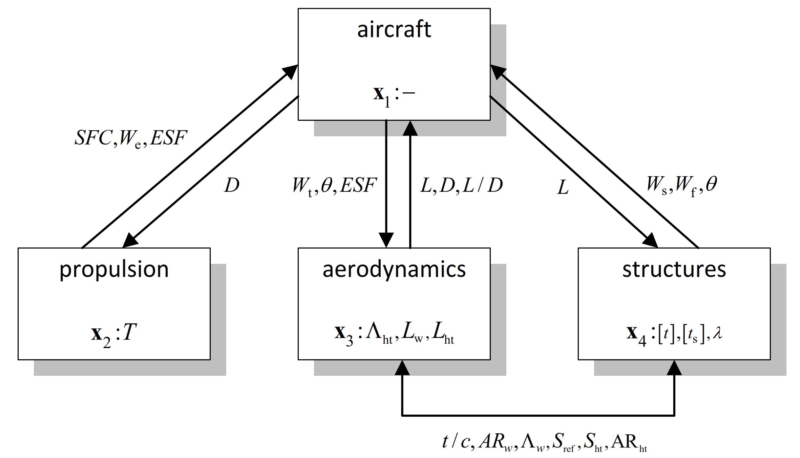
 |
|:--:|
| Fig.1 ATC formulation of SBJ distributed MDO problem|

All the files defining this formulation are given in the file [SBJ_subsystem_analysis_1.m](SBJ_subsystem_analysis_1.m). The first subproblem is given below:

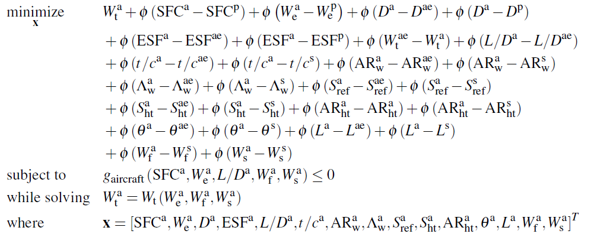

<!-- $$
\begin{equation*}
	\begin{aligned}
		& \underset{\mathbf{x}}{\text{minimize}}
		& & W_{\mathrm{t}}^{\mathrm{a}}+\phi\left(\mathrm{SFC}^{\mathrm{a}}-\mathrm{SFC}^{\mathrm{p}}\right)+\phi\left(W_{\mathrm{e}}^{\mathrm{a}}-W_{\mathrm{e}}^{\mathrm{p}}\right)+\phi\left(D^{\mathrm{a}}-D^{\mathrm{ae}}\right)+\phi\left(D^{\mathrm{a}}-D^{\mathrm{p}}\right)\\
    & & & +\phi\left(\mathrm{ESF}^{\mathrm{a}}-\mathrm{ESF}^{\mathrm{ae}}\right)+\phi\left(\mathrm{ESF}^{\mathrm{a}}-\mathrm{ESF}^{\mathrm{p}}\right)+\phi\left(W_{\mathrm{t}}^{\mathrm{ae}}-W_{\mathrm{t}}^{\mathrm{a}}\right)+\phi\left(L / D^{\mathrm{a}}-L / D^{\mathrm{ae}}\right) \\
    & & & +\phi\left(t / c^{\mathrm{a}}-t / c^{\mathrm{ae}}\right)+\phi\left(t / c^{\mathrm{a}}-t / c^{\mathrm{s}}\right)+\phi\left(\mathrm{AR}_{\mathrm{w}}^{\mathrm{a}}-\mathrm{AR}_{\mathrm{w}}^{\mathrm{ae}}\right)+\phi\left(\mathrm{AR}_{\mathrm{w}}^{\mathrm{a}}-\mathrm{AR}_{\mathrm{w}}^{\mathrm{s}}\right) \\
    & & & +\phi\left(\Lambda_{\mathrm{w}}^{\mathrm{a}}-\Lambda_{\mathrm{w}}^{\mathrm{ae}}\right)+\phi\left(\Lambda_{\mathrm{w}}^{\mathrm{a}}-\Lambda_{\mathrm{w}}^{\mathrm{s}}\right)+\phi\left(S_{\mathrm{ref}}^{\mathrm{a}}-S_{\mathrm{ref}}^{\mathrm{ae}}\right)+\phi\left(S_{\mathrm{ref}}^{\mathrm{a}}-S_{\mathrm{ref}}^{\mathrm{s}}\right) \\
    & & & +\phi\left(S_{\mathrm{ht}}^{\mathrm{a}}-S_{\mathrm{ht}}^{\mathrm{ae}}\right)+\phi\left(S_{\mathrm{ht}}^{\mathrm{a}}-S_{\mathrm{ht}}^{\mathrm{s}}\right)+\phi\left(\mathrm{AR}_{\mathrm{ht}}^{\mathrm{a}}-\mathrm{AR}_{\mathrm{ht}}^{\mathrm{a}}\right)+\phi\left(\mathrm{AR}_{\mathrm{ht}}^{\mathrm{a}}-\mathrm{AR}_{\mathrm{ht}}^{\mathrm{s}}\right) \\
    & & & +\phi\left(\theta^{\mathrm{a}}-\theta^{\mathrm{ae}}\right)+\phi\left(\theta^{\mathrm{a}}-\theta^{\mathrm{s}}\right)+\phi\left(L^{\mathrm{a}}-L^{\mathrm{ae}}\right)+\phi\left(L^{\mathrm{a}}-L^{\mathrm{s}}\right) \\
    & & & +\phi\left(W_{\mathrm{f}}^{\mathrm{a}}-W_{\mathrm{f}}^{\mathrm{s}}\right)+\phi\left(W_{\mathrm{s}}^{\mathrm{a}}-W_{\mathrm{s}}^{\mathrm{s}}\right) \\
		& \text{subject to}
		& & g_{\mathrm{aircraft}}\left(\mathrm{SFC}^{\mathrm{a}}, W_{\mathrm{e}}^{\mathrm{a}}, L / D^{\mathrm{a}}, W_{\mathrm{f}}^{\mathrm{a}}, W_{\mathrm{s}}^{\mathrm{a}}\right) \leq 0\\
    & \text{while solving}
		& & W_{\mathrm{t}}^{\mathrm{a}}=W_{\mathrm{t}}\left(W_{\mathrm{e}}^{\mathrm{a}}, W_{\mathrm{f}}^{\mathrm{a}}, W_{\mathrm{s}}^{\mathrm{a}}\right)\\
    & \text{where}
		& & \mathbf{x} = \left[\mathrm{SFC}^{\mathrm{a}}, W_{\mathrm{e}}^{\mathrm{a}}, D^{\mathrm{a}}, \mathrm{ESF}^{\mathrm{a}}, L / D^{\mathrm{a}}, t / c^{\mathrm{a}}, \mathrm{AR}_{\mathrm{w}}^{\mathrm{a}}, \Lambda_{\mathrm{w}}^{\mathrm{a}}, S_{\mathrm{ref}}^{\mathrm{a}}, S_{\mathrm{ht}}^{\mathrm{a}}, \mathrm{AR}_{\mathrm{ht}}^{\mathrm{a}}, \theta^{\mathrm{a}}, L^{\mathrm{a}}, W_{\mathrm{f}}^{\mathrm{a}}, W_{\mathrm{s}}^{\mathrm{a}}\right]^\textit{T}
	\end{aligned}
\end{equation*}
$$ -->

The objective/coupling variable $W_{\mathrm{t}}^{\mathrm{a}}$ is calculated by [SBJ_analysis_range.m](SBJ/SBJ_analysis_range.m). The constraint $g_{\mathrm{aircraft}}$ and the overall optimization problem are defined in case 1 in [SBJ_subsystem_analysis_1.m](SBJ_subsystem_analysis_1.m)`.

The second subproblem for the propulsion discipline is given below:

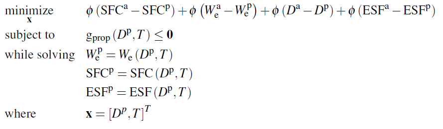

<!-- $$
\begin{equation*}
	\begin{aligned}
		& \underset{\mathbf{x}}{\text{minimize}}
		& & \phi\left(\mathrm{SFC}^{\mathrm{a}}-\mathrm{SFC}^{\mathrm{p}}\right)+\phi\left(W_{\mathrm{e}}^{\mathrm{a}}-W_{\mathrm{e}}^{\mathrm{p}}\right)+\phi\left(D^{\mathrm{a}}-D^{\mathrm{p}}\right)+\phi\left(\mathrm{ESF}^{\mathrm{a}}-\mathrm{ESF}^{\mathrm{p}}\right) \\
    & \text{subject to}
		& & \mathrm{g}_{\mathrm{prop}}\left(D^{\mathrm{p}}, T\right) \leq \mathbf{0} \\
    & \text{while solving}
		& & W_{\mathrm{e}}^{\mathrm{p}}=W_{\mathrm{e}}\left(D^{\mathrm{p}}, T\right) \\
    & & & \mathrm{SFC}^{\mathrm{p}}=\operatorname{SFC}\left(D^{\mathrm{p}}, T\right) \\
    & & & \mathrm{ESF}^{\mathrm{p}}=\mathrm{ESF}\left(D^{\mathrm{p}}, T\right) \\
    & \text{where}
		& & \mathbf{x} = \left[D^p,T\right]^\textit{T}
	\end{aligned}
\end{equation*}
$$ -->

The calculation of the coupling variables $W_{\mathrm{e}}^{\mathrm{p}}$, $\mathrm{SFC}^{\mathrm{p}}$, and $\mathrm{ESF}^{\mathrm{p}}$, is given by [SBJ_analysis_power.m](SBJ/SBJ_analysis_power.m). The calculation of the objective and constraint and definition of the optimization problem is given by case 2 in [SBJ_subsystem_analysis_1.m](SBJ_subsystem_analysis_1.m).

The third subproblem for the structural discipline is given below:

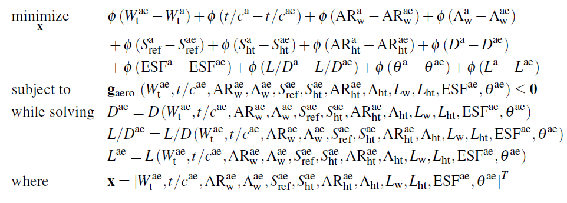

<!-- $$
\begin{equation*}
	\begin{aligned}
		& \underset{\mathbf{x}}{\text{minimize}}
		& & \phi\left(W_{\mathrm{t}}^{\mathrm{ae}}-W_{\mathrm{t}}^{\mathrm{a}}\right)+\phi\left(t / c^{\mathrm{a}}-t / c^{\mathrm{ae}}\right)+\phi\left(\mathrm{AR}_{\mathrm{w}}^{\mathrm{a}}-\mathrm{AR}_{\mathrm{w}}^{\mathrm{ae}}\right)+\phi\left(\Lambda_{\mathrm{w}}^{\mathrm{a}}-\Lambda_{\mathrm{w}}^{\mathrm{ae}}\right) \\
    & & & +\phi\left(S_{\mathrm{ref}}^{\mathrm{a}}-S_{\mathrm{ref}}^{\mathrm{ae}}\right)+\phi\left(S_{\mathrm{ht}}^{\mathrm{a}}-S_{\mathrm{ht}}^{\mathrm{ae}}\right)+\phi\left(\mathrm{AR}_{\mathrm{ht}}^{\mathrm{a}}-\mathrm{AR}_{\mathrm{ht}}^{\mathrm{ae}}\right)+\phi\left(D^{\mathrm{a}}-D^{\mathrm{ae}}\right) \\
    & & & +\phi\left(\mathrm{ESF}^{\mathrm{a}}-\mathrm{ESF}^{\mathrm{ae}}\right)+\phi\left(L / D^{\mathrm{a}}-L / D^{\mathrm{ae}}\right)+\phi\left(\theta^{\mathrm{a}}-\theta^{\mathrm{ae}}\right)+\phi\left(L^{\mathrm{a}}-L^{\mathrm{ae}}\right)\\
    & \text{subject to}
		& & \mathbf{g}_{\text {aero }}\left(W_{\mathrm{t}}^{\mathrm{ae}}, t / c^{\mathrm{ae}}, \mathrm{AR}_{\mathrm{w}}^{\mathrm{ae}}, \Lambda_{\mathrm{w}}^{\mathrm{ae}}, S_{\mathrm{ref}}^{\mathrm{ae}}, S_{\mathrm{ht}}^{\mathrm{ae}}, \mathrm{AR}_{\mathrm{ht}}^{\mathrm{ae}}, \Lambda_{\mathrm{ht}}, L_{\mathrm{w}}, L_{\mathrm{ht}}, \mathrm{ESF}^{\mathrm{ae}}, \theta^{\mathrm{ae}}\right) \leq \mathbf{0} \\
    & \text{while solving}
		& &   D^{\mathrm{ae}}=D\left(W_{\mathrm{t}}^{\mathrm{ae}}, t / c^{\mathrm{ae}}, \mathrm{AR}_{\mathrm{w}}^{\mathrm{ae}}, \Lambda_{\mathrm{w}}^{\mathrm{ae}}, S_{\mathrm{ref}}^{\mathrm{ae}}, S_{\mathrm{ht}}^{\mathrm{ae}}, \mathrm{AR}_{\mathrm{ht}}^{\mathrm{ae}}, \Lambda_{\mathrm{ht}}, L_{\mathrm{w}}, L_{\mathrm{ht}}, \mathrm{ESF}^{\mathrm{ae}}, \theta^{\mathrm{ae}}\right) \\
    & & & L / D^{\mathrm{ae}}=L / D\left(W_{\mathrm{t}}^{\mathrm{ae}}, t / c^{\mathrm{ae}}, \mathrm{AR}_{\mathrm{w}}^{\mathrm{ae}}, \Lambda_{\mathrm{w}}^{\mathrm{ae}}, S_{\mathrm{ref}}^{\mathrm{ae}}, S_{\mathrm{ht}}^{\mathrm{ae}}, \mathrm{AR}_{\mathrm{ht}}^{\mathrm{ae}}, \Lambda_{\mathrm{ht}}, L_{\mathrm{w}}, L_{\mathrm{ht}}, \mathrm{ESF}^{\mathrm{ae}}, \theta^{\mathrm{ae}}\right) \\
    & & & L^{\mathrm{ae}}=L\left(W_{\mathrm{t}}^{\mathrm{ae}}, t / c^{\mathrm{ae}}, \mathrm{AR}_{\mathrm{w}}^{\mathrm{ae}}, \Lambda_{\mathrm{w}}^{\mathrm{ae}}, S_{\mathrm{ref}}^{\mathrm{ae}}, S_{\mathrm{ht}}^{\mathrm{ae}}, \mathrm{AR}_{\mathrm{ht}}^{\mathrm{ae}}, \Lambda_{\mathrm{ht}}, L_{\mathrm{w}}, L_{\mathrm{ht}}, \mathrm{ESF}^{\mathrm{ae}}, \theta^{\mathrm{ae}}\right)\\
    & \text{where}
		& & \mathbf{x} = \left[W_{\mathrm{t}}^{\mathrm{ae}}, t / c^{\mathrm{ae}}, \mathrm{AR}_{\mathrm{w}}^{\mathrm{ae}}, \Lambda_{\mathrm{w}}^{\mathrm{ae}}, S_{\mathrm{ref}}^{\mathrm{ae}}, S_{\mathrm{ht}}^{\mathrm{ae}}, \mathrm{AR}_{\mathrm{ht}}^{\mathrm{ae}}, \Lambda_{\mathrm{ht}}, L_{\mathrm{w}}, L_{\mathrm{ht}}, \mathrm{ESF}^{\mathrm{ae}}, \theta^{\mathrm{ae}}\right]^\textit{T}
	\end{aligned}
\end{equation*}
$$ -->

There is no local objective. The calculation of the coupling variables $D^{\mathrm{ae}}$, $L / D^{\mathrm{ae}}$, and $L^{\mathrm{ae}}$, is given by [SBJ_analysis_dragpolar.m](SBJ/SBJ_analysis_dragpolar.m). The calculation of the constraints $\mathbf{g}_{\text {prop }}$ and definition of the optimization problem is given by case 3 in [SBJ_subsystem_analysis_1.m](SBJ_subsystem_analysis_1.m).

The fourth subproblem for the aerodynamics discipline is given below:

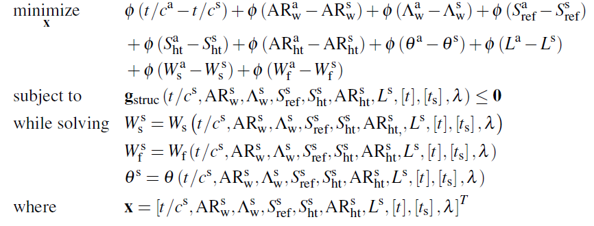

<!-- $$
\begin{equation*}
	\begin{aligned}
		& \underset{\mathbf{x}}{\text{minimize}}
		& & \phi\left(t / c^{\mathrm{a}}-t / c^{\mathrm{s}}\right)+\phi\left(\mathrm{AR}_{\mathrm{w}}^{\mathrm{a}}-\mathrm{AR}_{\mathrm{w}}^{\mathrm{s}}\right)+\phi\left(\Lambda_{\mathrm{w}}^{\mathrm{a}}-\Lambda_{\mathrm{w}}^{\mathrm{s}}\right)+\phi\left(S_{\mathrm{ref}}^{\mathrm{a}}-S_{\mathrm{ref}}^{\mathrm{s}}\right) \\
    & & & +\phi\left(S_{\mathrm{ht}}^{\mathrm{a}}-S_{\mathrm{ht}}^{\mathrm{s}}\right)+\phi\left(\mathrm{AR}_{\mathrm{ht}}^{\mathrm{a}}-\mathrm{AR}_{\mathrm{ht}}^{\mathrm{s}}\right)+\phi\left(\theta^{\mathrm{a}}-\theta^{\mathrm{s}}\right)+\phi\left(L^{\mathrm{a}}-L^{\mathrm{s}}\right) \\
    & & & +\phi\left(W_{\mathrm{s}}^{\mathrm{a}}-W_{\mathrm{s}}^{\mathrm{s}}\right)+\phi\left(W_{\mathrm{f}}^{\mathrm{a}}-W_{\mathrm{f}}^{\mathrm{s}}\right) \\
    & \text{subject to}
		& & \mathbf{g}_{\mathrm{struc}}\left(t / c^{\mathrm{s}}, \mathrm{AR}_{\mathrm{w}}^{\mathrm{s}}, \Lambda_{\mathrm{w}}^{\mathrm{s}}, S_{\mathrm{ref}}^{\mathrm{s}}, S_{\mathrm{ht}}^{\mathrm{s}}, \mathrm{AR}_{\mathrm{ht}}^{\mathrm{s}}, L^{\mathrm{s}},[t],\left[t_{\mathrm{s}}\right], \lambda\right) \leq \mathbf{0} \\
    & \text{while solving}
		& &   W_{\mathrm{s}}^{\mathrm{s}}=W_{\mathrm{s}}\left(t / c^{\mathrm{s}}, \mathrm{AR}_{\mathrm{w}}^{\mathrm{s}}, \Lambda_{\mathrm{w}}^{\mathrm{s}}, S_{\mathrm{ref}}^{\mathrm{s}}, S_{\mathrm{ht}}^{\mathrm{s}}, \mathrm{AR}_{\mathrm{ht},}^{\mathrm{s}}, L^{\mathrm{s}},[t],\left[t_{\mathrm{s}}\right], \lambda\right) \\
    & & & W_{\mathrm{f}}^{\mathrm{s}}=W_{\mathrm{f}}\left(t / c^{\mathrm{s}}, \mathrm{AR}_{\mathrm{w}}^{\mathrm{s}}, \Lambda_{\mathrm{w}}^{\mathrm{s}}, S_{\mathrm{ref}}^{\mathrm{s}}, S_{\mathrm{ht}}^{\mathrm{s}}, \mathrm{AR}_{\mathrm{ht}}^{\mathrm{s}}, L^{\mathrm{s}},[t],\left[t_{\mathrm{s}}\right], \lambda\right) \\
    & & & \theta^{\mathrm{s}}=\theta\left(t / c^{\mathrm{s}}, \mathrm{AR}_{\mathrm{w}}^{\mathrm{s}}, \Lambda_{\mathrm{w}}^{\mathrm{s}}, S_{\mathrm{ref}}^{\mathrm{s}}, S_{\mathrm{ht}}^{\mathrm{s}}, \mathrm{AR}_{\mathrm{ht}}^{\mathrm{s}}, L^{\mathrm{s}},[t],\left[t_{\mathrm{s}}\right], \lambda\right)\\
    & \text{where}
		& & \mathbf{x} = \left[t / c^{\mathrm{s}}, \mathrm{AR}_{\mathrm{w}}^{\mathrm{s}}, \Lambda_{\mathrm{w}}^{\mathrm{s}}, S_{\mathrm{ref}}^{\mathrm{s}}, S_{\mathrm{ht}}^{\mathrm{s}}, \mathrm{AR}_{\mathrm{ht}}^{\mathrm{s}}, L^{\mathrm{s}},[t],\left[t_{\mathrm{s}}\right], \lambda\right]^\textit{T}
	\end{aligned}
\end{equation*}
$$ -->

There is no local objective. The calculation of the coupling variables $W_{\mathrm{s}}^{\mathrm{s}}$, $W_{\mathrm{f}}^{\mathrm{s}}$, and $\theta^{\mathrm{s}}$, is given by [SBJ_analysis_structural.m](SBJ/SBJ_analysis_structural.m). The calculation of the constraints $\mathbf{g}_{\mathrm{struc}}$ and definition of the optimization problem is given by case 4 in [SBJ_subsystem_analysis_1.m](SBJ_subsystem_analysis_1.m).

The next step is to define all of our optimization variables. To do this more easily to break up the block diagram to let us easily see how many variables are associated with each subproblem.

| 
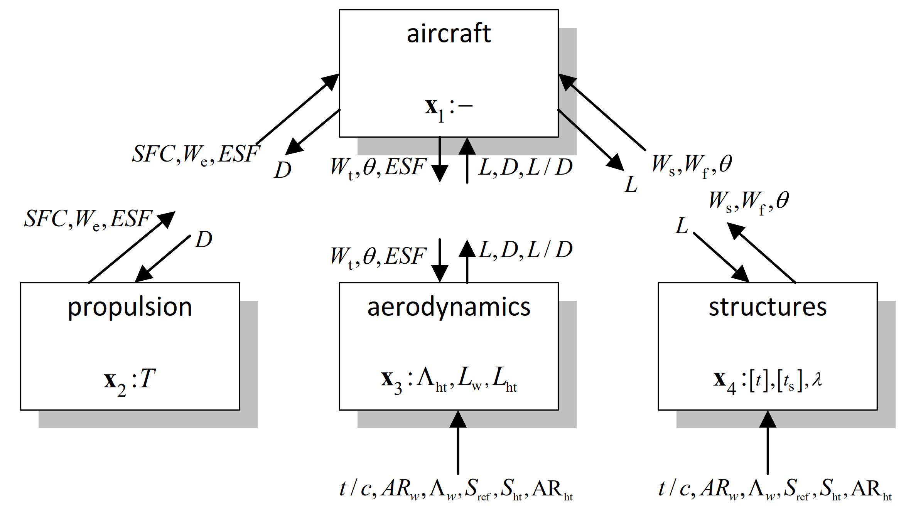
 |
|:--:|
| Fig.2 Breakdown of ATC formulation of SBJ distributed MDO problem|

We can now define the properties of each variable in the table below and code this in [SBJ_problem_definition_1.m](SBJ_problem_definition_1.m). This bookkeeping is the trickiest part of defining any distributed MDO problem.

| Index | Name | Subproblem | Coupling variable | Linking variable index | Dimensionality | lower bound | upper bound |
|-------|------|------------|-------------------|------------------------|----------------|----|----|
| 1     |`SFC_1`        | 1     | false |     15    | 1 |    1  |      4    |
| 2     |`We_1`         | 1     | false |     16    | 1 |  100  |  30000    |
| 3     |`ESF_1_2`      | 1     | false | 17,7      | 1 |  0.5  |    1.5    |
| 4     |`D_1_2`        | 1     |  true | 18,9      | 1 | 1000  |  70000    |
| 5     |`Wt_1`         | 1     |  true |     20    | 1 | 5000  | 100000    |
| 6     |`theta_1_3`    | 1     |  true | 21,14     | 1 |  0.2  |     50    |
| 7     |`ESF_1_3`      | 1     |  true | 17,3      | 1 |  0.5  |    1.5    |
| 8     |`L_1_3`        | 1     | false | 23,11     | 1 | 5000  | 100000    |
| 9     |`D_1_3`        | 1     | false | 24,4      | 1 | 1000  |  70000    |
| 10    |`LD_1`         | 1     | false |     25    | 1 |  0.1  |     10    |
| 11    |`L_1_4`        | 1     |  true | 35,8      | 1 | 5000  | 100000    |
| 12    |`Ws_1`         | 1     | false |     37    | 1 | 5000  | 100000    |
| 13    |`Wf_1`         | 1     | false |     38    | 1 | 5000  | 100000    |
| 14    |`theta_1_4`    | 1     | false | 36,6      | 1 |  0.2  |     50    |
| 15    |`SFC_2`        | 2     | true  | 1         | 1 |    1  |     4     |
| 16    |`We_2`         | 2     | true  | 2         | 1 |  100  | 30000     |
| 17    |`ESF_2`        | 2     | true  | 3         | 1 |  0.5  |   1.5     |
| 18    |`D_2`          | 2     | false | 4         | 1 | 1000  | 70000     |
| 19    |`T`            | 2     | false | None      | 1 |  0.1  |     1     |
| 20    |`Wt_3`         | 3     | false | 5         | 1 | 5000  | 100000    |
| 21    |`theta_3`      | 3     | false | 6         | 1 |  0.2  |     50    |
| 22    |`ESF_3`        | 3     | false | 7         | 1 |  0.5  |    1.5    |
| 23    |`L_3`          | 3     |  true | 8         | 1 | 5000  | 100000    |
| 24    |`D_3`          | 3     |  true | 9         | 1 | 1000  |  70000    |
| 25    |`LD_3`         | 3     |  true | 0         | 1 |  0.1  |     10    |
| 26    |`LAMBDAht`     | 3     | false | None      | 1 |   40  |     70    |
| 27    |`Lw`           | 3     | false | None      | 1 | 0.01  |    0.2    |
| 28    |`Lht`          | 3     | false | None      | 1 |    1  |    3.5    |
| 29    |`tc_3`         | 3     | false | 42        | 1 | 0.01  |    0.1    |
| 30    |`ARw_3`        | 3     | false | 43        | 1 |  2.5  |      8    |
| 31    |`LAMBDAw_3`    | 3     | false | 44        | 1 |   40  |     70    |
| 32    |`Sref_3`       | 3     | false | 45        | 1 |  200  |    800    |
| 33    |`Sht_3`        | 3     | false | 46        | 1 |   50  |  148.9    |
| 34    |`ARht_3`       | 3     | false | 47        | 1 |  2.5  |    8.5    |
| 35    |`L_4`          | 4     | false | 11        | 1 | 5000  | 100000    |
| 36    |`theta_4`      | 4     |  true | 14        | 1 |  0.2  |     50    |
| 37    |`Ws_4`         | 4     |  true | 12        | 1 | 5000  | 100000    |
| 38    |`Wf_4`         | 4     |  true | 13        | 1 | 5000  | 100000    |
| 39    |`lambda_4`     | 4     | false | None      | 1 |  0.1  |    0.4    |
| 40    |`t`            | 4     | false | None      | 9 |  0.1  |   4.0     |
| 41    |`ts`           | 4     | false | None      | 9 |  0.1  |   9.0     |
| 42    |`tc_4`         | 4     | false | 29        | 1 | 0.01  |   0.1     |
| 43    |`ARw_4`        | 4     | false | 30        | 1 |  2.5  |     8     |
| 44    |`LAMBDAw_4`    | 4     | false | 31        | 1 |   40  |    70     |
| 45    |`Sref_4`       | 4     | false | 32        | 1 |  200  |   800     |
| 46    |`Sht_4`        | 4     | false | 33        | 1 |   50  | 148.9     |
| 47    |`ARht_4`       | 4     | false | 34        | 1 |  2.5  |   8.5     |

Table.3 Definition of all MDO variables for SBJ formulation 1

You can follow the remaining steps in [SBJ_subsystem_analysis_1.m](SBJ_subsystem_analysis_1.m) to fully define all the inputs and outputs needed by `NoHiMDO` to solve the problem.

# Formulation (2): NHATC 
Formulation 2 is a non-hierarchal one shown below. The overall objective and constraints are the same as Formulation 1 and are also given by discipline 1, *aircraft*.

| 
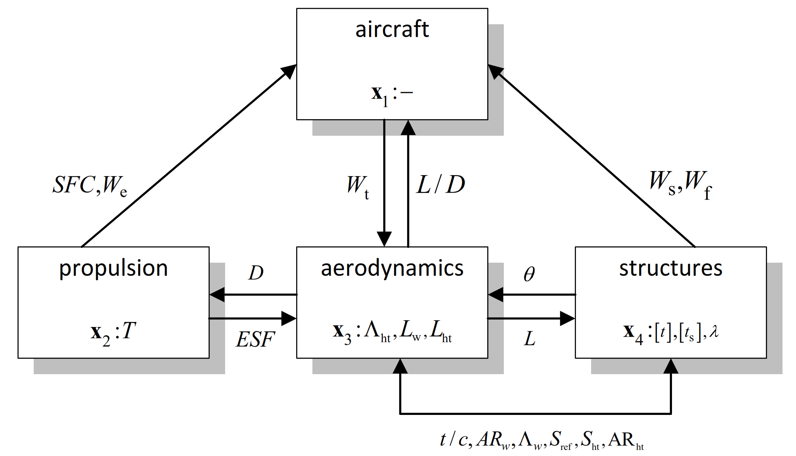
 |
|:--:|
| Fig.3 NHATC formulation of SBJ distributed MDO problem|

All the files defining this formulation are given in the file [SBJ_subsystem_analysis_2.m](SBJ_subsystem_analysis_2.m). The first subproblem is given below:

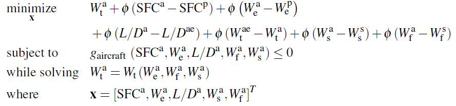

<!-- $$
\begin{equation*}
	\begin{aligned}
		& \underset{\mathbf{x}}{\text{minimize}}
		& & W_{\mathrm{t}}^{\mathrm{a}}+\phi\left(\mathrm{SFC}^{\mathrm{a}}-\mathrm{SFC}^{\mathrm{p}}\right)+\phi\left(W_{\mathrm{e}}^{\mathrm{a}}-W_{\mathrm{e}}^{\mathrm{p}}\right)\\
    & & & +\phi\left(L / D^{\mathrm{a}}-L / D^{\mathrm{ae}}\right)+\phi\left(W_{\mathrm{t}}^{\mathrm{ae}}-W_{\mathrm{t}}^{\mathrm{a}}\right)+\phi\left(W_{\mathrm{s}}^{\mathrm{a}}-W_{\mathrm{s}}^{\mathrm{s}}\right)+\phi\left(W_{\mathrm{f}}^{\mathrm{a}}-W_{\mathrm{f}}^{\mathrm{s}}\right) \\
		& \text{subject to}
		& & g_{\text {aircraft }}\left(\mathrm{SFC}^{\mathrm{a}}, W_{\mathrm{e}}^{\mathrm{a}}, L / D^{\mathrm{a}}, W_{\mathrm{f}}^{\mathrm{a}}, W_{\mathrm{s}}^{\mathrm{a}}\right) \leq \mathbf{0} \\
    & \text{while solving}
		& & W_{\mathrm{t}}^{\mathrm{a}}=W_{\mathrm{t}}\left(W_{\mathrm{e}}^{\mathrm{a}}, W_{\mathrm{f}}^{\mathrm{a}}, W_{\mathrm{s}}^{\mathrm{a}}\right)\\
    & \text{where}
		& & \mathbf{x} = \left[\mathrm{SFC}^{\mathrm{a}}, W_{\mathrm{e}}^{\mathrm{a}}, L / D^{\mathrm{a}}, W_{\mathrm{s}}^{\mathrm{a}}, W_{\mathrm{f}}^{\mathrm{a}}\right]^\textit{T}
	\end{aligned}
\end{equation*}
$$ -->

The objective/coupling variable $W_{\mathrm{t}}^{\mathrm{a}}$ is calculated by [SBJ_analysis_range.m](SBJ/SBJ_analysis_range.m). The constraint $g_{\mathrm{aircraft}}$ and the overall optimization problem are defined in case 1 in [SBJ_subsystem_analysis_2.m](SBJ_subsystem_analysis_2.m)

The second subproblem for the propulsion discipline is given below:

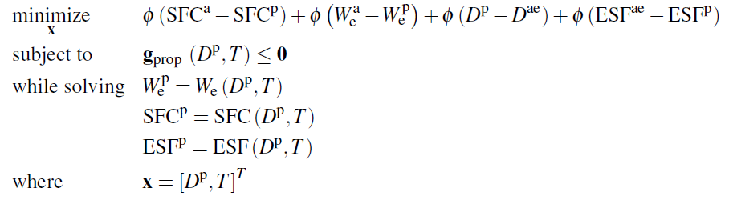

<!-- $$
\begin{equation*}
	\begin{aligned}
		& \underset{\mathbf{x}}{\text{minimize}}
		& & \phi\left(\mathrm{SFC}^{\mathrm{a}}-\mathrm{SFC}^{\mathrm{p}}\right)+\phi\left(W_{\mathrm{e}}^{\mathrm{a}}-W_{\mathrm{e}}^{\mathrm{p}}\right)+\phi\left(D^{\mathrm{p}}-D^{\mathrm{ae}}\right)+\phi\left(\mathrm{ESF}^{\mathrm{ae}}-\mathrm{ESF}^{\mathrm{p}}\right) \\
    & \text{subject to}
		& & \mathbf{g}_{\text {prop }}\left(D^{\mathrm{p}}, T\right) \leq \mathbf{0} \\
    & \text{while solving}
		& & W_{\mathrm{e}}^{\mathrm{p}}=W_{\mathrm{e}}\left(D^{\mathrm{p}}, T\right) \\
    & & & \mathrm{SFC}^{\mathrm{p}}=\operatorname{SFC}\left(D^{\mathrm{p}}, T\right) \\
    & & & \mathrm{ESF}^{\mathrm{p}}=\operatorname{ESF}\left(D^{\mathrm{p}}, T\right) \\
    & \text{where}
		& & \mathbf{x} = \left[D^{\mathrm{p}}, T\right]^\textit{T}
	\end{aligned}
\end{equation*}
$$ -->

The calculation of the coupling variables $W_{\mathrm{e}}^{\mathrm{p}}$, $\mathrm{SFC}^{\mathrm{p}}$, and $\mathrm{ESF}^{\mathrm{p}}$, is given by [SBJ_analysis_power.m](SBJ/SBJ_analysis_power.m). The calculation of the objective and constraint and definition of the optimization problem is given by case 2 in [SBJ_subsystem_analysis_2.m](SBJ_subsystem_analysis_2.m).

The third subproblem for the structural discipline is given below:

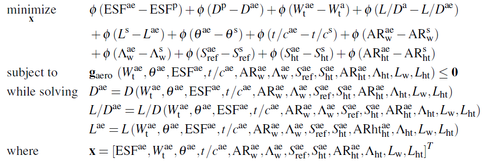

<!-- $$
\begin{equation*}
	\begin{aligned}
		& \underset{\mathbf{x}}{\text{minimize}}
		& & \phi\left(\mathrm{ESF}^{\mathrm{ae}}-\mathrm{ESF}^{\mathrm{p}}\right)+\phi\left(D^{\mathrm{p}}-D^{\mathrm{ae}}\right)+\phi\left(W_{\mathrm{t}}^{\mathrm{ae}}-W_{\mathrm{t}}^{\mathrm{a}}\right)+\phi\left(L / D^{\mathrm{a}}-L / D^{\mathrm{ae}}\right) \\
    & & & +\phi\left(L^{\mathrm{s}}-L^{\mathrm{ae}}\right)+\phi\left(\theta^{\mathrm{ae}}-\theta^{\mathrm{s}}\right)+\phi\left(t / c^{\mathrm{ae}}-t / c^{\mathrm{s}}\right)+\phi\left(\mathrm{AR}_{\mathrm{w}}^{\mathrm{ae}}-\mathrm{AR}_{\mathrm{w}}^{\mathrm{s}}\right) \\
    & & & +\phi\left(\Lambda_{\mathrm{w}}^{\mathrm{ae}}-\Lambda_{\mathrm{w}}^{\mathrm{s}}\right)+\phi\left(S_{\mathrm{ref}}^{\mathrm{ae}}-S_{\mathrm{ref}}^{\mathrm{s}}\right)+\phi\left(S_{\mathrm{ht}}^{\mathrm{ae}}-S_{\mathrm{ht}}^{\mathrm{s}}\right)+\phi\left(\mathrm{AR}_{\mathrm{ht}}^{\mathrm{ae}}-\mathrm{AR}_{\mathrm{ht}}^{\mathrm{s}}\right) \\
    & \text{subject to}
		& & \mathbf{g}_{\text {aero }}\left(W_{\mathrm{t}}^{\mathrm{ae}}, \theta^{\mathrm{ae}}, \mathrm{ESF}^{\mathrm{ae}}, t / c^{\mathrm{ae}}, \mathrm{AR}_{\mathrm{w}}^{\mathrm{ae}}, \Lambda_{\mathrm{w}}^{\mathrm{ae}}, S_{\mathrm{ref}}^{\mathrm{ae}}, S_{\mathrm{ht}}^{\mathrm{ae}}, \mathrm{AR}_{\mathrm{ht}}^{\mathrm{ae}}, \Lambda_{\mathrm{ht}}, L_{\mathrm{w}}, L_{\mathrm{ht}}\right) \leq \mathbf{0} \\
    & \text{while solving}
		& & D^{\mathrm{ae}}=D\left(W_{\mathrm{t}}^{\mathrm{ae}}, \theta^{\mathrm{ae}}, \mathrm{ESF}^{\mathrm{ae}}, t / c^{\mathrm{ae}}, \mathrm{AR}_{\mathrm{w}}^{\mathrm{ae}}, \Lambda_{\mathrm{w}}^{\mathrm{ae}}, S_{\mathrm{ref}}^{\mathrm{ae}}, S_{\mathrm{ht}}^{\mathrm{ae}}, \mathrm{AR}_{\mathrm{ht}}^{\mathrm{ae}}, \Lambda_{\mathrm{ht}}, L_{\mathrm{w}}, L_{\mathrm{ht}}\right) \\
    & & & L / D^{\mathrm{ae}}=L / D\left(W_{\mathrm{t}}^{\mathrm{ae}}, \theta^{\mathrm{ae}}, \mathrm{ESF}^{\mathrm{ae}}, t / c^{\mathrm{ae}}, \mathrm{AR}_{\mathrm{w}}^{\mathrm{ae}}, \Lambda_{\mathrm{w}}^{\mathrm{ae}}, S_{\mathrm{ref}}^{\mathrm{ae}}, S_{\mathrm{ht}}^{\mathrm{ae}}, \mathrm{AR}_{\mathrm{ht}}^{\mathrm{ae}}, \Lambda_{\mathrm{ht}}, L_{\mathrm{w}}, L_{\mathrm{ht}}\right) \\
    & & & L^{\mathrm{ae}}=L\left(W_{\mathrm{t}}^{\mathrm{ae}}, \theta^{\mathrm{ae}}, \mathrm{ESF}^{\mathrm{ae}}, t / c^{\mathrm{ae}}, \mathrm{AR}_{\mathrm{w}}^{\mathrm{ae}}, \Lambda_{\mathrm{w}}^{\mathrm{ae}}, S_{\mathrm{ref}}^{\mathrm{ae}}, S_{\mathrm{ht}}^{\mathrm{ae}}, \mathrm{AR} \mathrm{ht}_{\mathrm{ht}}^{\mathrm{ae}}, \Lambda_{\mathrm{ht}}, L_{\mathrm{w}}, L_{\mathrm{ht}}\right) \\
    & \text{where}
		& & \mathbf{x} = \left[\mathrm{ESF}^{\mathrm{ae}}, W_{\mathrm{t}}^{\mathrm{ae}}, \theta^{\mathrm{ae}}, t / c^{\mathrm{ae}}, \mathrm{AR}_{\mathrm{w}}^{\mathrm{ae}}, \Lambda_{\mathrm{w}}^{\mathrm{ae}}, S_{\mathrm{ref}}^{\mathrm{ae}}, S_{\mathrm{ht}}^{\mathrm{ae}}, \mathrm{AR}_{\mathrm{ht}}^{\mathrm{ae}}, \Lambda_{\mathrm{ht}}, L_{\mathrm{w}}, L_{\mathrm{ht}}\right]^\textit{T}
	\end{aligned}
\end{equation*}
$$ -->

There is no local objective. The calculation of the coupling variables $D^{\mathrm{ae}}$, $L / D^{\mathrm{ae}}$, and $L^{\mathrm{ae}}$, is given by [SBJ_analysis_dragpolar.m](SBJ/SBJ_analysis_dragpolar.m). The calculation of the constraints $\mathbf{g}_{\text {prop }}$ and definition of the optimization problem is given by case 3 in [SBJ_subsystem_analysis_2.m](SBJ_subsystem_analysis_2.m).

The fourth subproblem for the aerodynamics discipline is given below:

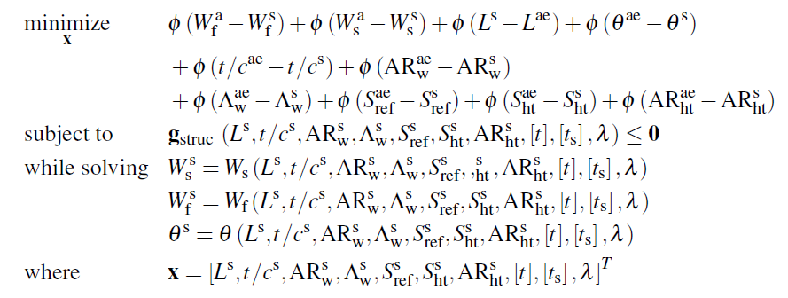

<!-- $$
\begin{equation*}
	\begin{aligned}
		& \underset{\mathbf{x}}{\text{minimize}}
		& & \phi\left(W_{\mathrm{f}}^{\mathrm{a}}-W_{\mathrm{f}}^{\mathrm{s}}\right)+\phi\left(W_{\mathrm{s}}^{\mathrm{a}}-W_{\mathrm{s}}^{\mathrm{s}}\right)+\phi\left(L^{\mathrm{s}}-L^{\mathrm{ae}}\right)+\phi\left(\theta^{\mathrm{ae}}-\theta^{\mathrm{s}}\right) \\
    & & & +\phi\left(t / c^{\mathrm{ae}}-t / c^{\mathrm{s}}\right)+\phi\left(\mathrm{AR}_{\mathrm{w}}^{\mathrm{ae}}-\mathrm{AR}_{\mathrm{w}}^{\mathrm{s}}\right) \\
    & & & +\phi\left(\Lambda_{\mathrm{w}}^{\mathrm{ae}}-\Lambda_{\mathrm{w}}^{\mathrm{s}}\right)+\phi\left(S_{\mathrm{ref}}^{\mathrm{ae}}-S_{\mathrm{ref}}^{\mathrm{s}}\right)+\phi\left(S_{\mathrm{ht}}^{\mathrm{ae}}-S_{\mathrm{ht}}^{\mathrm{s}}\right)+\phi\left(\mathrm{AR}_{\mathrm{ht}}^{\mathrm{ae}}-\mathrm{AR}_{\mathrm{ht}}^{\mathrm{s}}\right) \\
    & \text{subject to}
		& & \mathbf{g}_{\text {struc }}\left(L^{\mathrm{s}}, t / c^{\mathrm{s}}, \mathrm{AR}_{\mathrm{w}}^{\mathrm{s}}, \Lambda_{\mathrm{w}}^{\mathrm{s}}, S_{\mathrm{ref}}^{\mathrm{s}}, S_{\mathrm{ht}}^{\mathrm{s}}, \mathrm{AR}_{\mathrm{ht}}^{\mathrm{s}},[t],\left[t_{\mathrm{s}}\right], \lambda\right) \leq \mathbf{0} \\
    & \text{while solving}
		& & W_{\mathrm{s}}^{\mathrm{s}}=W_{\mathrm{s}}\left(L^{\mathrm{s}}, t / c^{\mathrm{s}}, \mathrm{AR}_{\mathrm{w}}^{\mathrm{s}}, \Lambda_{\mathrm{w}}^{\mathrm{s}}, S_{\mathrm{ref}}^{\mathrm{s}},,_{\mathrm{ht}}^{\mathrm{s}}, \mathrm{AR}_{\mathrm{ht}}^{\mathrm{s}},[t],\left[t_{\mathrm{s}}\right], \lambda\right) \\
    & & & W_{\mathrm{f}}^{\mathrm{s}}=W_{\mathrm{f}}\left(L^{\mathrm{s}}, t / c^{\mathrm{s}}, \mathrm{AR}_{\mathrm{w}}^{\mathrm{s}}, \Lambda_{\mathrm{w}}^{\mathrm{s}}, S_{\mathrm{ref}}^{\mathrm{s}}, S_{\mathrm{ht}}^{\mathrm{s}}, \mathrm{AR}_{\mathrm{ht}}^{\mathrm{s}},[t],\left[t_{\mathrm{s}}\right], \lambda\right) \\
    & & & \theta^{\mathrm{s}}=\theta\left(L^{\mathrm{s}}, t / c^{\mathrm{s}}, \mathrm{AR}_{\mathrm{w}}^{\mathrm{s}}, \Lambda_{\mathrm{w}}^{\mathrm{s}}, S_{\mathrm{ref}}^{\mathrm{s}}, S_{\mathrm{ht}}^{\mathrm{s}}, \mathrm{AR}_{\mathrm{ht}}^{\mathrm{s}},[t],\left[t_{\mathrm{s}}\right], \lambda\right)\\
    & \text{where}
		& & \mathbf{x} = \left[L^{\mathrm{s}}, t / c^{\mathrm{s}}, \mathrm{AR}_{\mathrm{w}}^{\mathrm{s}}, \Lambda_{\mathrm{w}}^{\mathrm{s}}, S_{\mathrm{ref}}^{\mathrm{s}}, S_{\mathrm{ht}}^{\mathrm{s}}, \mathrm{AR}_{\mathrm{ht}}^{\mathrm{s}},[t],\left[t_{\mathrm{s}}\right], \lambda\right]^\textit{T}
	\end{aligned}
\end{equation*}
$$ -->

There is no local objective. The calculation of the coupling variables $W_{\mathrm{s}}^{\mathrm{s}}$, $W_{\mathrm{f}}^{\mathrm{s}}$, and $\theta^{\mathrm{s}}$, is given by [SBJ_analysis_structural.m](SBJ/SBJ_analysis_structural.m). The calculation of the constraints $\mathbf{g}_{\mathrm{struc}}$ and definition of the optimization problem is given by case 4 in [SBJ_subsystem_analysis_2.m](SBJ_subsystem_analysis_2.m).

The next step is to define all of our optimization variables. To do this more easily to break up the block diagram to let us easily see how many variables are associated with each subproblem.

| 
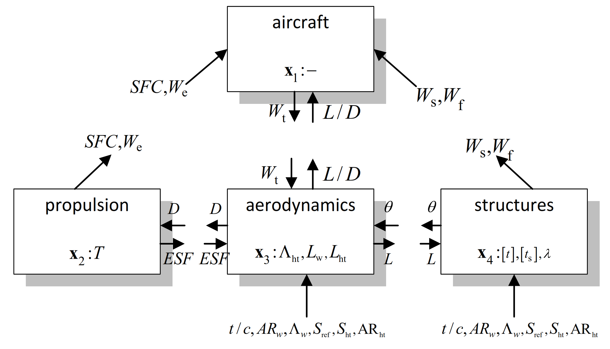
 |
|:--:|
| Fig.4 Breakdown of NHATC formulation of SBJ distributed MDO problem|

We can now define the properties of each variable in the table below and code this in [SBJ_problem_definition_2.m](SBJ_problem_definition_2.m). Again Figure 4 will help us for bookkeeping of the distributed MDO problem's variables.

| Index | Name | Subproblem | Coupling variable | Linking variable index/name | Dimensionality | lower bound | upper bound |
|-------|------|------------|-------------------|------------------------|----------------|----|----|
| 1     |  `SFC_1`      | 1 | false | `SFC_2`   | 1 |    1  |      4    |
| 2     |  `We_1`       | 1 | false |  `We_2`   | 1 |  100  |  30000    |
| 3     |  `LD_1`       | 1 | false |  `LD_3`   | 1 |  0.1  |     10    |
| 4     |  `Ws_1`       | 1 | false |  `Ws_4`   | 1 | 5000  | 100000    |
| 5     |  `Wf_1`       | 1 | false |      35   | 1 | 5000  | 100000    |
| 6     |  `Wt_1`       | 1 |  true |      13   | 1 | 5000  | 100000    |
| 7     |  `D_2`        | 2 | false |      24   | 1 | 1000  |  70000    |
| 8     |  `T`          | 2 | false |      None | 1 |  0.1  |      1    |
| 9     |  `We_2`       | 2 |  true |       2   | 1 |  100  |  30000    |
| 10    | `SFC_2`       | 2 |  true |       1   | 1 |    1  |      4    |
| 11    | `ESF_2`       | 2 |  true |      12   | 1 |  0.5  |    1.5    |
| 12    | `ESF_3`       | 3 | false |      11   | 1 |  0.5  |    1.5    |
| 13    | `Wt_3`        | 3 | false |       6   | 1 | 5000  | 100000    |
| 14    | `theta_3`     | 3 | false |      36   | 1 |  0.2  |     50    |
| 15    | `tc_3`        | 3 | false |      28   | 1 | 0.01  |    0.1    |
| 16    | `ARw_3`       | 3 | false |      29   | 1 |  2.5  |      8    |
| 17    | `LAMBDAw_3`   | 3 | false |      30   | 1 |   40  |     70    |
| 18    | `Sref_3`      | 3 | false |      31   | 1 |  200  |    800    |
| 19    | `Sht_3`       | 3 | false |      32   | 1 |   50  |  148.9    |
| 20    | `ARht_3`      | 3 | false |      33   | 1 |  2.5  |    8.5    |
| 21    | `LAMBDAht`    | 3 | false |      None | 1 |   40  |     70    |
| 22    | `Lw`          | 3 | false |      None | 1 | 0.01  |    0.2    |
| 23    | `Lht`         | 3 | false |      None | 1 |    1  |    3.5    |
| 24    | `D_3`         | 3 |  true |       7   | 1 | 1000  |  70000    |
| 25    | `LD_3`        | 3 |  true |       3   | 1 |  0.1  |     10    |
| 26    | `L_3`         | 3 |  true |      27   | 1 | 5000  | 100000    |
| 27    | `L_4`         | 4 | false |      26   | 1 | 5000  | 100000    |
| 28    | `tc_4`        | 4 | false |      15   | 1 | 0.01  |    0.1    |
| 29    | `ARw_4`       | 4 | false |      16   | 1 |  2.5  |      8    |
| 30    | `LAMBDAw_4`   | 4 | false |      17   | 1 |   40  |     70    |
| 31    | `Sref_4`      | 4 | false |      18   | 1 |  200  |    800    |
| 32    | `Sht_4`       | 4 | false |      19   | 1 |   50  |  148.9    |
| 33    | `ARht_4`      | 4 | false |      20   | 1 |  2.5  |    8.5    |
| 34    | `Ws_4`        | 4 |  true |       4   | 1 | 5000  | 100000    |
| 35    | `Wf_4`        | 4 |  true |       5   | 1 | 5000  | 100000    |
| 36    | `theta_4`     | 4 |  true |      14   | 1 |  0.2  |     50    |
| 37    | `lambda_4`    | 4 | false |      None | 1 |  0.1  |    0.4    |
| 38    | `t`           | 4 | false |      None | 9 |  0.1  |    4.0    |
| 39    | `ts`          | 4 | false |      None | 9 |  0.1  |    9.0    |

Table.4 Definition of all MDO variables for SBJ formulation 2
 

You can follow the remaining steps in [SBJ_subsystem_analysis_2.m](SBJ_subsystem_analysis_2.m) to fully define all the inputs and outputs needed by `NoHiMDO` to solve the problem.